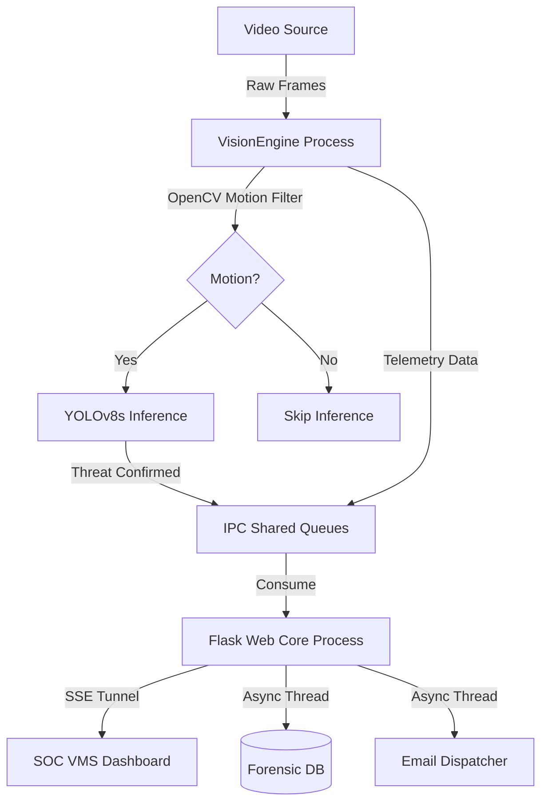

<div align="center">

# SAMAR 🛡️
**Intelligent Perimeter Security & Edge Computing System**

[](https://www.python.org)
[](https://github.com/ultralytics/ultralytics)
[](https://opencv.org/)
[](https://flask.palletsprojects.com/)
[](#)

*An enterprise-grade, zero-cloud Video Management System (VMS) engineered for high-concurrency threat detection, autonomous forensic archiving, and real-time Server-Sent Events (SSE) telemetry.*

---
</div>

## 📌 Overview
SAMAR (*Sistema de Alerta y Monitoreo Activo con Reconocimiento*) was originally prototyped as a capstone engineering project (UNP) and has evolved into a **Production-Ready Edge Computing Security System**. 

Designed to eliminate "alarm fatigue" in high-traffic enterprise environments, SAMAR operates entirely on-premise. It guarantees absolute data privacy and ultra-low latency without reliance on external cloud APIs, utilizing a state-of-the-art hybrid AI detection motor.

## 🚀 Enterprise Features

- **Multi-Process Architecture (GIL-Bypass):** Python's Global Interpreter Lock is bypassed by isolating the heavy hardware-accelerated computer vision tasks (Producer) from the Flask web server and I/O tasks (Consumer) using Inter-Process Communication (IPC) queues.
- **Hybrid Detection Motor (OpenCV + YOLOv8s):** To conserve CPU/GPU cycles, a low-cost OpenCV background subtraction filter actively monitors pixel variations. The heavy YOLOv8s neural network is strictly triggered only upon physical motion validation, eliminating false positives (shadows, pets).
- **VMS Command Center (SOC Dashboard):** A Deep Navy "Enterprise Light" tactical dashboard featuring a Native OpenCV HUD, a local System Audit Console, and native CSS radial charts.
- **Zero-Latency Telemetry (SSE):** Replaces traditional HTTP polling with a persistent, unidirectional TCP tunnel (Server-Sent Events) for real-time node monitoring (CPU load, detection ratios).
- **Automated Forensic Data Management:** Autonomous background daemon threads handle high-quality JPEG evidence extraction, asynchronous SMTP email dispatching, and SQLite logging.
- **SecOps Hardened:** Strict HTTP security headers (CSP, X-Frame-Options), complete secret abstraction via `.env`, parameterized SQL queries, and zero hardcoded credentials.

---

## 🏗️ Architecture



*(For a deep dive into the engineering decisions, see [ARCHITECTURE.md](ARCHITECTURE.md)).*

---

## 🛠️ Installation & Setup

### 1. Prerequisites
- Python 3.8+
- Git
- A connected webcam or video feed

### 2. Clone and Install
```bash
# Clone the repository
git clone https://github.com/LyLheo/samar-detector-python.git
cd samar-detector-python

# Create and activate a virtual environment
python -m venv venv

# Windows
.\venv\Scripts\activate
# Linux/macOS
source venv/bin/activate

# Install dependencies
pip install -r requirements.txt
```

### 3. Environment Configuration (SecOps)
SAMAR requires an Application Password from your Google Account to dispatch email alerts autonomously.
Create a `.env` file in the root directory (you can use `.env.example` as a template):

```env
# .env
GMAIL_USER="your-email@gmail.com"
GMAIL_PASS="your-16-digit-app-password"
GMAIL_DESTINO="security-team@example.com"
FLASK_SECRET_KEY="auto-generated-if-empty"
FLASK_DEBUG="False"
```
> **Note:** The `.env` file is strictly ignored by `.gitignore` to prevent credential leakage.

---

## 🏃‍♂️ Usage

Activate your virtual environment and launch the main web orchestrator:

```bash
python webapp.py
```

The system will boot the Vision Engine, allocate shared memory, and start the Flask server.
Open your browser and navigate to the SOC Command Center:
**http://localhost:5000**

---

<div align="center">
  <i>Engineered for Performance. Hardened for Security.</i>
</div>
